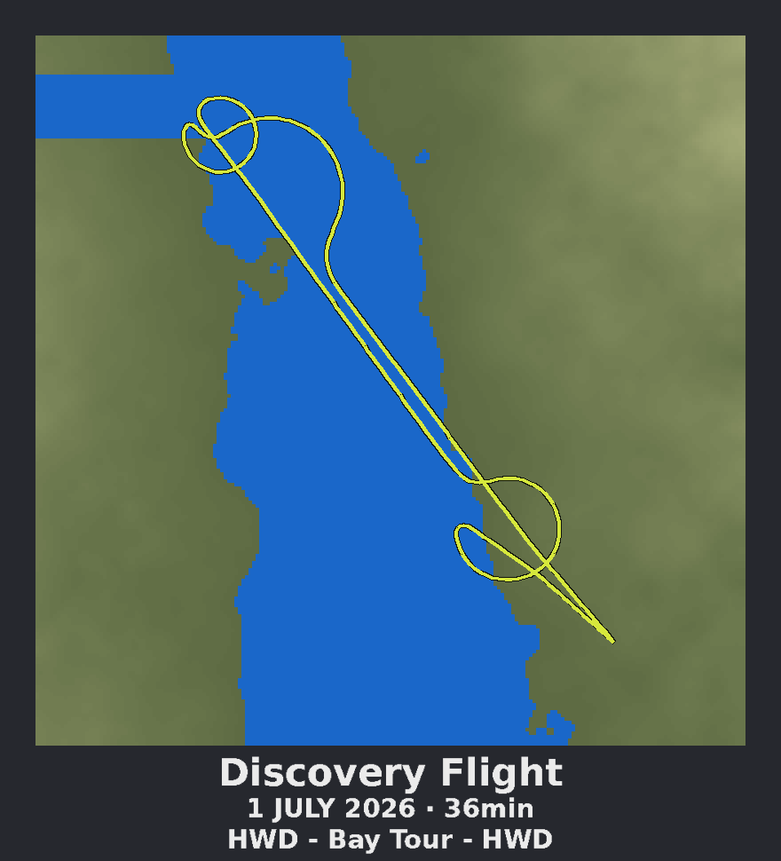

# FlightPathPrint

Turn a GPS log of a flight into a 3D-printable memento — like the
"I 3D Printed My Discovery Flight Path" shadow box: your flight path
(position **and** altitude) swept as a tube above a stepped topographic
terrain map, flat water, a picture frame, and a raised-text plaque with
the flight's title, date, duration, and route.



## Quick start

```bash
pip install numpy pillow requests

# Offline demo (synthetic bay tour):
python3 flightpath_print.py --demo

# Your real flight (GPX from ForeFlight, Garmin Pilot, FlightAware, ...):
python3 flightpath_print.py --gpx myflight.gpx \
    --title "Discovery Flight" \
    --route "HWD - Bay Tour - HWD"
```

The plaque's date/duration line is filled in automatically from the GPX
timestamps (override with `--date-line "1 JULY 2026 · 36min"`).

Real-world terrain is sampled from the free [AWS Terrain Tiles]
(terrarium encoding, no API key). Tiles are cached in
`~/.cache/flightpath_tiles/` so re-runs are fast.

[AWS Terrain Tiles]: https://registry.opendata.aws/terrain-tiles/

## Output

Everything lands in `output/` (change with `--out`), already positioned
in a shared coordinate system:

| File              | Part                          | Suggested filament |
|-------------------|-------------------------------|--------------------|
| `frame.stl`       | base plate + frame + bezel    | black              |
| `water.stl`       | flat water plate              | blue               |
| `terrain.stl`     | stepped topographic terrain   | olive green        |
| `flight_path.stl` | the flight, altitude included | neon yellow        |
| `text.stl`        | raised plaque text            | white              |
| `all_in_one.stl`  | all parts merged              | single-color ref   |
| `preview.png`     | top-down render               | sanity check       |

## Printing

**Multi-material printer (AMS / MMU):** import the five part STLs into
one slicer plate *as a single object* (PrusaSlicer: "import as parts";
Bambu/Orca: "yes" to loading as one object with multiple parts). They
are pre-aligned — don't move them individually. Assign a filament to
each part and print. The parts overlap by 0.2 mm where they meet so
they fuse together.

**Single-extruder printer:** print `frame.stl` + `water.stl` +
`terrain.stl` as separate jobs (or use layer-based color changes for
water→terrain, since water tops out below the first terrain step) and
glue the stack. Print `flight_path.stl` separately with tree supports —
it's a thin free-form tube, so slow it down and use a brim — then glue
it on at the takeoff/landing points, where the tube dips to ground
level. `text.stl` is easiest printed as part of the frame with a color
change, or glued on.

## Tuning knobs

| Flag                 | Default | What it does                                  |
|----------------------|---------|-----------------------------------------------|
| `--map-width-mm`     | 160     | width of the map area (frame adds ~16 mm)     |
| `--relief-mm`        | 14      | height of the tallest terrain above the water |
| `--contour-m`        | 40      | contour step in metres (the "topo" look)      |
| `--grid`             | 200     | terrain resolution (cells across the map)     |
| `--tube-mm`          | 3.2     | flight path tube diameter                     |
| `--alt-exaggeration` | 1.0     | vertical exaggeration of the path only        |
| `--margin`           | 0.18    | map margin around the track's bounding box    |
| `--sea-level-m`      | 0.5     | elevations at/below this become water         |
| `--zoom`             | auto    | terrain tile zoom level override              |

Flat inland flight with no visible relief? Raise `--alt-exaggeration`
so the path's climbs and descents still read. Terrain too spiky or too
smooth? Adjust `--contour-m` and `--relief-mm`.

## How it works

1. Parse the GPX track (lat/lon/ele/time) and pick a map bounding box
   around it, aspect-clamped so the frame stays roughly rectangular.
2. Sample an elevation grid from AWS Terrain Tiles (or synthesize one
   in `--demo` mode), split it into water vs. land at `--sea-level-m`,
   and quantize land into `--contour-m` steps.
3. Emit the terrain as stepped square columns (only exterior walls —
   no internal geometry), the water as a flat plate, and the frame as
   boxes.
4. Resample + smooth the track, scale altitude with the same
   metres→mm factor as the terrain, clamp it just above the ground so
   the tube emerges from the runway at takeoff and landing, and sweep
   a circular cross-section along it (parallel-transport frames).
5. Rasterize the plaque text with Pillow and extrude it from the pixel
   mask onto the bezel.
6. Write everything as binary STLs with a built-in writer — no CAD
   dependencies.
